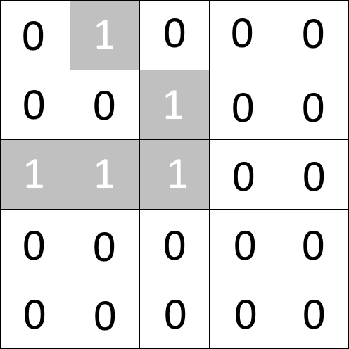

# Game of Life
You are going to build the famous "Conway’s Game of Life". This will not be an easy task, but we guarantee that you will succeed! And once you are finished you will be one step closer to calling yourself a master of the array - the most fundamental data structure in computer programming.

By the end of this exercise you will learn:
- How to work with single and multidimensional arrays.
- How to approach larger problems and break them into smaller and more manageable tasks.

And never forget that there are many ways to solve a problem, so as long as your solution works – you have nothing to worry about!

Let us begin.

## Overview
"Game of Life" is not really a game. There are no players, no points, no winning nor losing. There are rules though!

"Game of Life" has 4 simple, but elegant rules.

You start with a grid and each square in the grid is a cell that is either "alive" (`1`) or "dead" (`0`).



Play proceeds in rounds. During each round, each cell looks at its 8 immediate neighbors and counts up the number of them that are currently alive. 

For example, the cell in the middle has 2 alive and 6 dead neighbors.


## Rules

The state of each cell for the next run is determined by the following 4 rules:
1. Any live cell with 0 or 1 live neighbors becomes dead, because of underpopulation
1. Any live cell with 2 or 3 live neighbors stays alive, because its neighborhood is just right
1. Any live cell with more than 3 live neighbors becomes dead, because of overpopulation
1. Any dead cell with exactly 3 live neighbors becomes alive, by reproduction

And that is all there is to "Game of Life".  

## Applying the rules

Let's say you start with the following initial matrix (**Generation #0**).
```
0 0 0
1 1 1
0 1 0
```

To apply the rules of "Game of Life" to each cell we would need its coordinates or row and column.

```
        column 0  column 1  column 2
row 0      0         0         0
row 1      1         1         1
row 2      0         1         0
```
Therefore, the cell at `row:0`, `column:0` has a `value:0` which means it is `dead`, the cell at `row:1`, `column:1` has a `value:1` which means it is `alive` and so on... 

```
cell at [0,0] is 0 (dead)
cell at [0,1] is 0 (dead)
cell at [0,2] is 0 (dead)

cell at [1,0] is 1 (alive)
cell at [1,1] is 1 (alive)
cell at [1,2] is 1 (alive)

cell at [2,0] is 0 (dead)
cell at [2,1] is 1 (alive)
cell at [2,2] is 0 (dead)
```

To calculate the next generation (*Generation #1*) you have to **apply the rules for each cell independently**.

Cell at [0,0] is (dead) and has 3 immediate neighbours: [1,0] (alive), [1,1] (alive) and [0,1] (dead)
According to the rules, cell at [0,0] will remain dead in the next generation.

Cell at [0,1] is (dead) and has 5 immediate neighbours:
```
 [0,0] (dead)
 [1,0] (alive)
 [1,1] (alive)
 [1,2] (alive)
 [0,2] (dead)
```
**Here is the kicker!** Rule #4 says: "Any dead cell with exactly 3 live neighbors becomes alive, by reproduction"

Therefore, cell at [0,1] will be alive (1) in *Generation #1*.

Here's Generation #1 after applying the rules.

```
Generation #0           Generation #1
                       
  0  0  0                 0  1  0   
  1  1  1                 1  1  1   
  0  1  0                 1  1  1
```

Try moving one generation further to see if you can apply the rules by hand. To see if you are correct, check Generation #2 at the bottom of the page.

## Your Task
Implement all the required methods in the template ***without*** modifying the code in `Main`.

## Hints
A project such as this one is easier to approach if you first break it into small, testable parts. This would allow you to focus on doing one, manageable thing at a time. Once you have tested and verified that these smaller parts work correctly you can easily combine them in order to build your larger and more complex solution. 
A good set of milestones for this project could be:
1. Get familiar with how a multidimensional array works and use it to represent the grid.
1. Explore different ways to print a 2D array on the console.
1. Given a grid of arbitrary number of "dead" or "alive" cells, implement a method that can calculate the next state of each cell.

**Good luck!**

---

```
Generation #0           Generation #1           Generation #2

  0  0  0                 0  1  0                 0  1  0
  1  1  1                 1  1  1                 1  1  1
  0  1  0                 1  1  1                 1  1  1
```